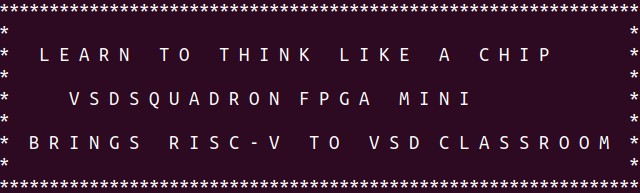

# [VSDSquadron FPGA mini](https://www.vlsisystemdesign.com/vsdsquadronfm/) Lab: Basic Message Display on RISC-V core
<div align="center">
  
</div>

## Prerequisites
Install the following tools before proceeding:
```bash
# General dependencies
sudo apt-get install git vim autoconf automake autotools-dev curl libmpc-dev \
libmpfr-dev libgmp-dev gawk build-essential bison flex texinfo gperf libtool \
patchutils bc zlib1g-dev libexpat1-dev gtkwave picocom -y

# FPGA toolchain (Yosys/NextPNR/IceStorm)
sudo apt-get install yosys nextpnr-ice40 icestorm iverilog -y

# RISC-V Toolchain (GCC 8.3.0)
cd ~
mkdir -p riscv_toolchain && cd riscv_toolchain
wget "https://static.dev.sifive.com/dev-tools/riscv64-unknown-elf-gcc-8.3.0-2019.08.0-x86_64-linux-ubuntu14.tar.gz"
tar -xvzf riscv64-unknown-elf-gcc-*.tar.gz
echo 'export PATH=$HOME/riscv_toolchain/riscv64-unknown-elf-gcc-8.3.0-2019.08.0-x86_64-linux-ubuntu14/bin:$PATH' >> ~/.bashrc
source ~/.bashrc
 ```
---

## Setup
1. Clone the repository:
   ```bash
   cd ~
   git clone https://github.com/vsdip/vsdfpga_labs
   ```

---

## Hardware Connections
| Source Component | Source Pin/Port | Destination Component       | Destination Pin/Port |
|------------------|-----------------|------------------------------|----------------------|
| CH340            | TX              | [VSDFPGA Board](https://www.vlsisystemdesign.com/vsdsquadronfm/)  | 3                    |
| CH340            | RXD             | [VSDFPGA Board](https://www.vlsisystemdesign.com/vsdsquadronfm/)  | 4                    |
| [VSDFPGA Board](https://www.vlsisystemdesign.com/vsdsquadronfm/)       | GND             | FPGA Board                   | 23                   |
| CH340            | 3.3V            | CH340                        | VCC                  |

- Connect the [VSDSquadron FPGA mini](https://www.vlsisystemdesign.com/vsdsquadronfm/) board to one USB port.
- Connect the CH340 module to another USB port.

---

## Building & Flashing
1. Review the RISC-V logo code (do not modify):
   ```bash
   cd ~/vsdfpga_labs/basicRISCV/Firmware
   nano riscv_logo.c  # Review and close (Ctrl+X)
   make riscv_logo.bram.hex
   ```
You should see the below messages


2. Build the firmware and FPGA bitstream:
   ```bash
   cd ~/vsdfpga_labs/basicRISCV/RTL
   make clean
   make build
   ```

3. Flash to FPGA:
   ```bash
   sudo make flash
   ```

---

## Running the Lab
1. Open the serial terminal:
   ```bash
   make terminal
   ```
   **Expected Output**:  
   You should see repeated messages containing RISC-V logo data (e.g., ASCII art patterns).
   
   
   

3. Press `Ctrl+A → Ctrl+Q` to exit `picocom`.

---

## Notes
1. If `/dev/ttyUSB0` is unavailable, update `PICO_DEVICE` in the `Makefile`.
2. The RISC-V toolchain must be in your `PATH` (configured in prerequisites).
3. Ensure all hardware connections match the table above for UART communication.

